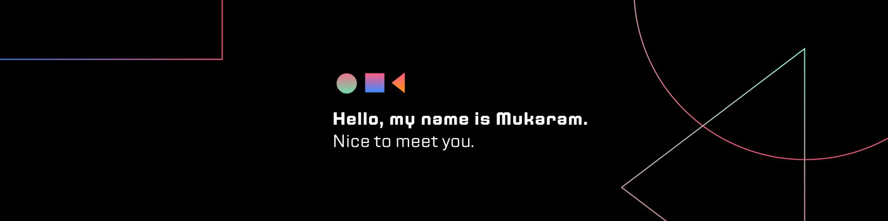

<!--Banner-->

###

  
  

###

<h1 align="center">👋 Hi, I'm Muhammad Mukaram Awan</h1>

###

<h3 align="center">Full Stack AI Engineer | MERN | React Native | Gen AI | Machine Learning | Deep Learning | Computer Vision</h3>

###

I'm a <strong>Full Stack AI Engineer</strong> with 2+ years of experience building scalable AI applications. I specialize in <strong>MERN, React Native, Python, FastAPI, LangChain, and LangGraph</strong>, with hands-on experience in <strong>LLMs, AI Agents, Guardrails, AI Security, LLMOps, Machine Learning, and Computer Vision</strong>. Passionate about building secure, production-ready AI systems that solve real-world problems.

###

<h3 align="left">🛠 Tech Stack</h3>

###

  
  
  
  
  
  
  
  
  
  
  
  
  
  
  
  
  
  
  
  
  
  
  
  
  
  
  
  
  
  
  
  
  
  
  
  
  
  
  
  
  
  
  
  
  
  
  
  
  

###

<h3 align="left">🔥   Stats :</h3>

###

  

###
